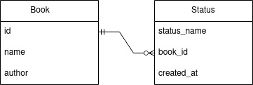

# BookTracker

A site for tracking books that you want to read or currently reading.

Main features are:
* track books you currently reading;
* track books you want to read;
* save books you've read with start/end dates.

Possible future features include:
* stats;
* time/page tracking;
* progress page;
* friends?

## MVP

* created all necessary models;
* all data can be CRUD from frontend;
* admin site is ready to use.

## Database schema v0.0.1

